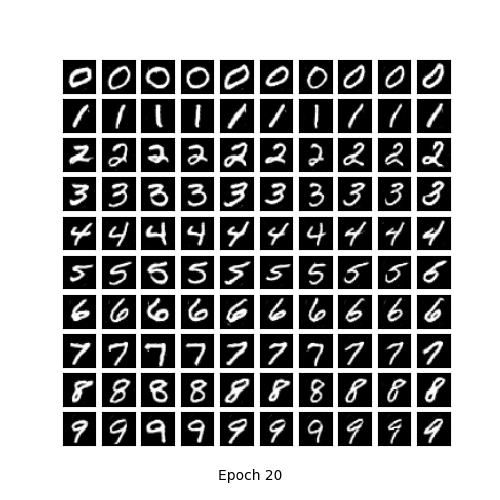
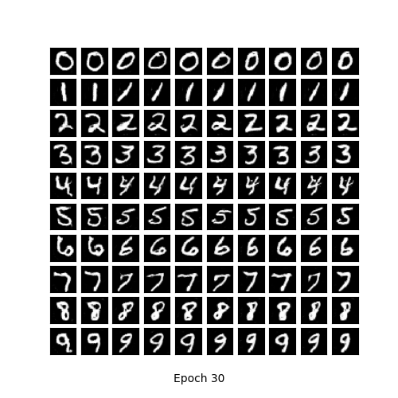
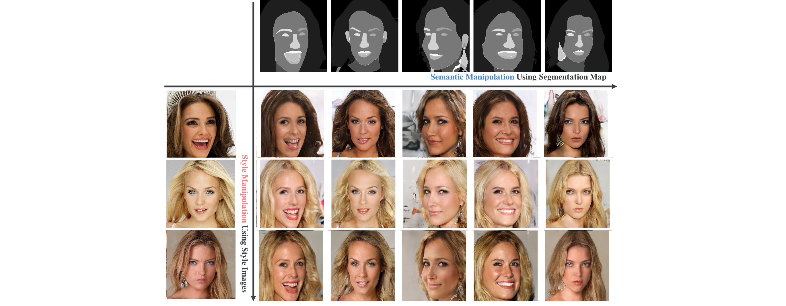
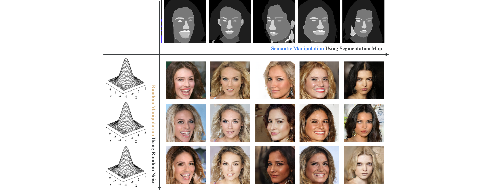

# Conditional-GAN-cDCGAN-acGANs-pix2pix-GauGAN


## Three different methods to direct the image generation process
 - Conditional GANs based on class label (cGANs, acGANs)
 - Conditional GANs based on edge maps (pix2pix)
 - Conditional GANs based on semantic information (Spade)
 
 

## Reference

 - uM. Mirza and S. Osindero. Conditional generative adversarial nets. arXiv preprint arXiv:1411.1784, 2014.
   
 
 - Augustus Odena, Christopher Olah, and Jonathon Shlens. Conditional image synthesis with auxiliary classifier GANs. In ICML, 2017.
   
 - Isola P , Zhu J Y , Zhou T , et al. Image-to-Image Translation with Conditional Adversarial  Networks[J]. CVPR, 2017.
   
 - Park T , Liu M Y , Wang T C , et al. Semantic Image Synthesis with Spatially-Adaptive Normalization[J]. 2019.
   
   
   
## Train
nohup python -u tensorflow_MNIST_cDCGAN_1.py > out_cdcgans.log 2>&1 &

nohup python -u acgan.py > out_acgan.log 2>&1 &

nohup python -u main.py --dataset CelebAMask-HQ  --img_ch 3 --segmap_ch 3 --gpu '1' --phase train > out_1.log 2>&1 &

nohup python -u pix2pix.py --mode train --output_dir /data/output/checkpoints/origin3_2/   --max_epochs 1000 --separable_conv --batch_size 1 --l1_weight 100 --input_dir /data/data/233/cart7_combined/ --which_direction AtoB > out.log 2>&1 & (most parameters could be set on demand)
## random_test for gaugan
python main.py --dataset CelebAMask-HQ --segmap_ch 3 --phase random

## Guide test for gaugan
python main.py --dataset CelebAMask-HQ --img_ch 3 --segmap_ch 3 --phase guide --guide_img 0.jpg

## test command for pix2pix
python pix2pix.py --mode test --output_dir D:\AI\Deecamp\GAN\data\output\test_images --input_dir D:\AI\Deecamp\GAN\data\val_256_en --checkpoint facades_train

## export command for pix2pix
python pix2pix.py --mode export --output_dir export_new_1_L1_6 --checkpoint /data/output/checkpoints/origin3_2

## test the exporting model:
python process-local.py --model_dir /data/code/233/pix2pix-origin/export_0806 --input_file 1.png --output_file 2.png


## Usage
```
├── dataset
  └── YOUR_DATASET_NAME
    ├── images
      ├── training
        ├── 000001.jpg
        ├── 000002.png
        └── ...
      ├── validation
        ├── 000001.jpg
        ├── 000002.png
        └── ...
    ├── annotations
      ├── training
        ├── 000001.jpg
        ├── 000002.png
        └── ...
      ├── validation
        ├── 000001.jpg
        ├── 000002.png
        └── ...
0.jpg (example for guided image translation task)

```

**CelebAMask-HQ**
* Download from [here](https://github.com/switchablenorms/CelebAMask-HQ)
You could use celebmask.py to handle the dataset.


## result

<table align='center'>
<tr align='center'>
<td> </td>
<td> traditional conditional GANs </td>
<td> acGANs </td>
</tr>
<tr align='center'>
<td></td>
<td>
<td>
</tr>
</table>
<tr align='center'>
<td></td>
guided image generation
<td>
random image generation(guagan)
<td>
colorization by pix2pix
<td>
</tr>

Reference：
https://github.com/taki0112/SPADE-Tensorflow


